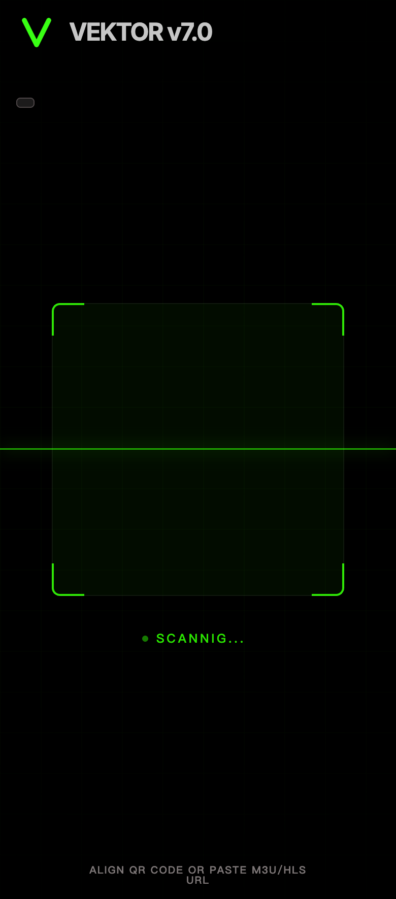
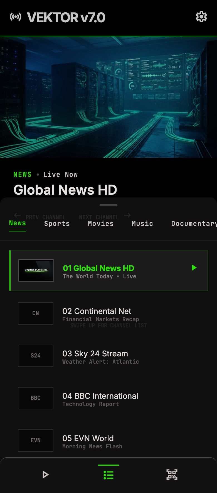

# Vektor v7.0 Design Specification

## 1. 设计目标

Vektor v7.0 的界面服务于“扫码即播”的单一任务。设计必须让用户在低光环境中快速识别状态、快速开始播放、快速切换频道，同时尽量隐藏非必要控件。

设计来源：

- [扫码态参考图](./stitch_vektor_minimalist_m3u_player/vektor_scan_state/screen.png)
- [播放态参考图](./stitch_vektor_minimalist_m3u_player/vektor_play_state/screen.png)
- [Logo 参考图](./stitch_vektor_minimalist_m3u_player/vektor_logo/screen.png)
- [原始设计系统](./stitch_vektor_minimalist_m3u_player/vektor_v7.0/DESIGN.md)

产品边界以 PRD 为准。参考图中的示例频道、示例机房图片和底部导航只作为视觉与交互参考，不代表新增内容推荐、账号、搜索或复杂设置。

## 2. 视觉语言

### 2.1 风格关键词

- 高对比极简。
- OLED 友好黑色界面。
- 技术工具感。
- 低干扰观看。
- 绿色活跃态。

界面应像一个高性能播放仪表，而不是内容平台首页。播放内容始终优先，控制 UI 在不需要时保持隐形或低透明度。

### 2.2 色彩令牌

| 用途 | 色值 | 使用方式 |
| --- | --- | --- |
| 主背景 | `#000000` | 播放背景、扫码背景、沉浸区域 |
| 页面背景 | `#131313` | 次级背景、暗色容器 |
| 抽屉背景 | `rgba(19, 19, 19, 0.8)` | 频道抽屉，叠加 20px blur |
| 主要文字 | `#e5e2e1` | 标题、频道名称、关键 UI |
| 次级文字 | `#cfc4c5` | 提示、说明、频道元信息 |
| 分割线 | `#4c4546` | 抽屉分隔、列表边框 |
| 活跃绿 | `#2ae500` | 扫描线、当前频道、选中分组、播放状态 |
| 高亮绿 | `#39FF14` | Logo 与强强调场景，可与活跃绿统一 |

活跃绿必须克制使用，只用于“正在扫描、正在播放、当前选中、可交互焦点”等高价值状态。

### 2.3 字体

| 类型 | 字体 | 用途 |
| --- | --- | --- |
| 主字体 | Inter | 标题、频道名、常规 UI |
| 等宽字体 | JetBrains Mono | 分组、频道序号、技术状态、提示文案 |

建议字号：

- 品牌标题：24px，700。
- 页面标题/当前频道：24px，600。
- 频道列表标题：16px，600。
- 常规说明：14px，400。
- 标签/状态：10-12px，JetBrains Mono，500，适当增加字距。

移动端紧凑区域不得使用过大的标题字，避免遮挡播放内容或抽屉列表。

### 2.4 形状与层级

- 主形状以硬边矩形为主。
- 扫码框、频道 Logo 容器、列表项使用 0-4px 圆角。
- 抽屉顶部可使用 4-12px 圆角，用于提示可拖拽。
- 不使用明显投影，层级通过透明度、边框和背景模糊表达。
- 重要边框使用 1px，当前频道左侧活跃条使用 2px。

## 3. 核心界面

### 3.1 扫码态

参考图：

#### 布局

- 全屏为摄像头取景区域。
- 背景叠加极轻网格纹理或暗色遮罩，实际实现中不得影响摄像头识别。
- 顶部安全区内显示 Vektor Logo 和品牌名 `VEKTOR`，版本号不进入品牌组合。
- 屏幕中部显示正方形扫描框，移动端参考尺寸约为屏幕宽度的 70%-75%。
- 扫描框下方显示扫描状态。
- 底部安全区显示默认提示或剪贴板载入入口。

#### 组件

- **Logo**：绿色 V 字符号，保持锐利线条。
- **扫描框**：四角绿色描边，中间为透明或极低透明绿色遮罩。
- **扫描线**：1px 活跃绿横线，带轻微发光，从上至下循环移动。
- **状态文案**：`SCANNING...`，使用 JetBrains Mono，活跃绿。
- **底部提示**：`ALIGN QR CODE OR PASTE M3U/HLS URL`，低透明次级文字。
- **剪贴板入口**：仅在检测到合法链接时出现，位于底部提示区域，可使用边框按钮或整行触发区。

#### 状态

| 状态 | 表现 |
| --- | --- |
| 正在扫描 | 绿色扫描线循环，状态文案轻微呼吸 |
| 检测到非法二维码 | 扫描框短暂弱闪，不弹出阻断弹窗 |
| 检测到合法链接 | 扫描框和扫描线短暂增强，随后切入播放态 |
| 摄像头无权限 | 保留扫描框视觉，底部提示授权入口 |
| 剪贴板可载入 | 底部提示替换为可点击载入区 |

### 3.2 播放态

参考图：

#### 布局

- 顶部安全区显示当前连接/播放状态、品牌名和极小重置触发区。
- 上方为 16:9 视频播放区，宽度铺满屏幕。
- 视频区下方显示当前频道分组、直播状态、频道标题。
- 下方区域作为抽屉触发区，上滑展开频道列表。
- 频道抽屉展开时覆盖屏幕下方约 60% 高度，保留视频上方感知。

#### 视频区

- 视频内容填充 16:9 容器。
- 未加载完成时显示黑底加载反馈。
- 直播播放时不强制显示进度条。
- 交互控制层在用户触摸后出现，约 2 秒无操作后淡出。
- 控制层可展示播放/暂停、简单状态标签和直播信息，但不得压过频道切换主流程。

#### 当前频道信息

- 分组使用活跃绿等宽标签，例如 `NEWS`。
- 直播状态使用次级文字，例如 `Live Now`。
- 当前频道标题使用主字体高亮展示，例如 `Global News HD`。
- 上/下频道提示保持低透明，只作为手势暗示。

#### 频道抽屉

- 顶部居中放置 32px 宽拖拽条。
- 抽屉背景使用半透明黑色和 20px blur。
- 分组 Tabs 横向滚动，选中项为活跃绿并带底部线。
- 频道列表为高密度纵向列表。
- 当前频道使用活跃绿标题、左侧 2px 活跃条和播放图标。
- 未选中频道使用主文字 + 次级元信息。
- Logo 区域固定 16:10 比例；无 Logo 时显示频道缩写或序号。

#### 底部快捷区

参考图中底部有播放、列表、扫码图标。实际产品仍遵循双状态原则：

- 播放图标可作为当前播放状态提示。
- 列表图标可作为抽屉状态提示。
- 扫码图标可作为“重回扫码”的低干扰入口。
- 不得扩展为多 Tab 首页或复杂导航。

## 4. 交互与动效

### 4.1 扫描动效

- 扫描线从上至下循环移动，单次周期约 2.5-4 秒。
- 状态文案可轻微透明度呼吸。
- 检测命中时扫描框短暂亮度提升，持续约 150-250ms。
- 成功后立即进入状态切换，不停留在成功页。

### 4.2 抽屉动效

- 从底部上滑展开，使用 ease-out，时长约 300-500ms。
- 收起时下沉到仅露出当前频道信息和触发区。
- 点击频道后，先触发频道切换，再自动收起抽屉。
- 抽屉展开时列表可滚动，分组 Tabs 固定在抽屉顶部。

### 4.3 手势热区

| 区域 | 手势 | 反馈 |
| --- | --- | --- |
| 视频左半区 | 上下滑 | 显示亮度条，短暂淡出 |
| 视频右半区 | 上下滑 | 显示音量条，短暂淡出 |
| 下半屏，抽屉收起 | 左右滑 | 切换上/下频道，频道标题更新 |
| 下方信息区 | 上滑 | 抽屉展开 |
| 抽屉区域 | 下滑 | 抽屉收起 |
| 全局 | 双指下滑 | 播放停止，切回扫码态 |

手势反馈应轻量，不使用大面积弹窗。

### 4.4 失败反馈

- 非法二维码、非法剪贴板链接：底部短文本提示，1.5-2 秒后消失。
- 播放失败：视频区显示简短错误和重试状态，同时允许切换频道。
- 无频道：显示“无可播放频道”，随后提供回扫码路径。
- 权限失败：在扫码框区域显示说明，底部保留剪贴板入口。

## 5. 组件规范

### 5.1 Logo

- Logo 使用绿色 V 形折线。
- 扫码态、播放态、App Icon 使用同一 Vektor 标记，不得混用系统图标作为品牌 Logo。
- 品牌组合固定为图形 Logo + `VEKTOR`，不包含 `v7.0` 等版本信息。
- App Icon 使用黑底 `#000000` + Neon Green `#2AE500` 的 V 形标记。
- Logo 不应占用过多播放空间，移动端页头建议 36-40dp/pt。

### 5.2 分组 Tab

- 高度约 44-52px。
- 横向滚动，不换行。
- 选中项：活跃绿文字 + 1px 底线。
- 未选中项：次级文字。
- 文案使用 JetBrains Mono 或等宽样式。

### 5.3 频道列表项

- 高度建议 72-96px。
- 左侧 Logo 容器固定宽高，保持列表稳定。
- 中间显示频道序号 + 名称。
- 下方显示可选元信息，如节目名、直播状态。
- 右侧仅当前项或 hover/聚焦项显示播放图标。

### 5.4 系统反馈条

亮度、音量、播放加载等临时反馈统一使用：

- 黑色半透明背景。
- 1px 灰色边框。
- 活跃绿表示当前值或进行中状态。
- 1-2 秒无操作后淡出。

## 6. 适配要求

### 6.1 移动端基准

现有参考稿尺寸为 780 x 1768，可作为高密度移动端基准。实现时应适配：

- 刘海屏和底部 Home Indicator 安全区。
- 常见 19.5:9、20:9 Android 机型。
- 横竖屏策略由播放器实现决定；v7.0 默认以竖屏主流程验收。

### 6.2 文本与可读性

- 所有关键文本必须在黑色背景上满足高对比。
- 底部提示可低透明，但不得低到无法阅读。
- 频道标题过长时单行截断，列表元信息可单行截断。
- 分组 Tab 不压缩文字，使用横向滚动。

### 6.3 触控尺寸

- 常用触发区高度不低于 44px。
- 隐式手势区域必须足够大，避免只依赖小按钮。
- 极小重置触发区仅作为双指下滑的补充，不应成为唯一入口。

## 7. 设计验收

- 扫码态与参考图一致：黑底、顶部品牌、中央扫描框、绿色扫描线、底部提示。
- 播放态与参考图一致：顶部品牌、16:9 视频区、当前频道信息、上滑频道抽屉、分组 Tabs、频道列表。
- 活跃绿仅用于状态、选中和当前播放，不大面积铺色。
- 抽屉展开后高度约为屏幕 60%，列表可滚动。
- 视频播放时控制 UI 能自动淡出。
- 字体层级清晰，频道名、分组、元信息能快速区分。
- Logo 缺失时的频道序号/缩写占位与有 Logo 的列表项保持同等尺寸。
- 不出现账号、推荐、搜索、复杂设置等超出 PRD 的界面入口。
